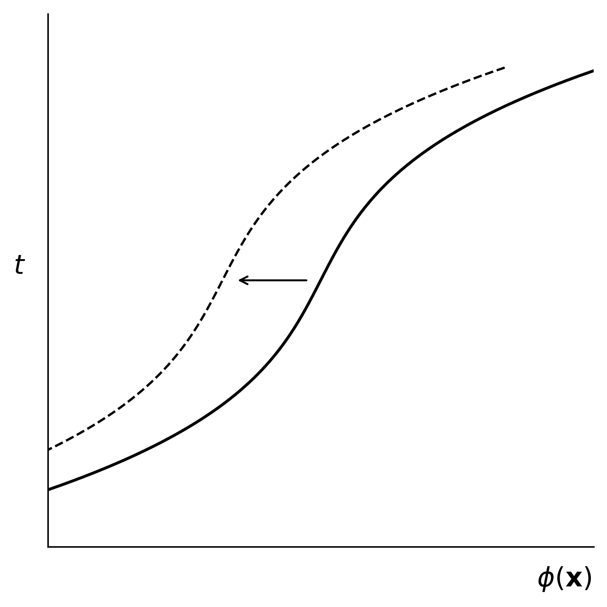
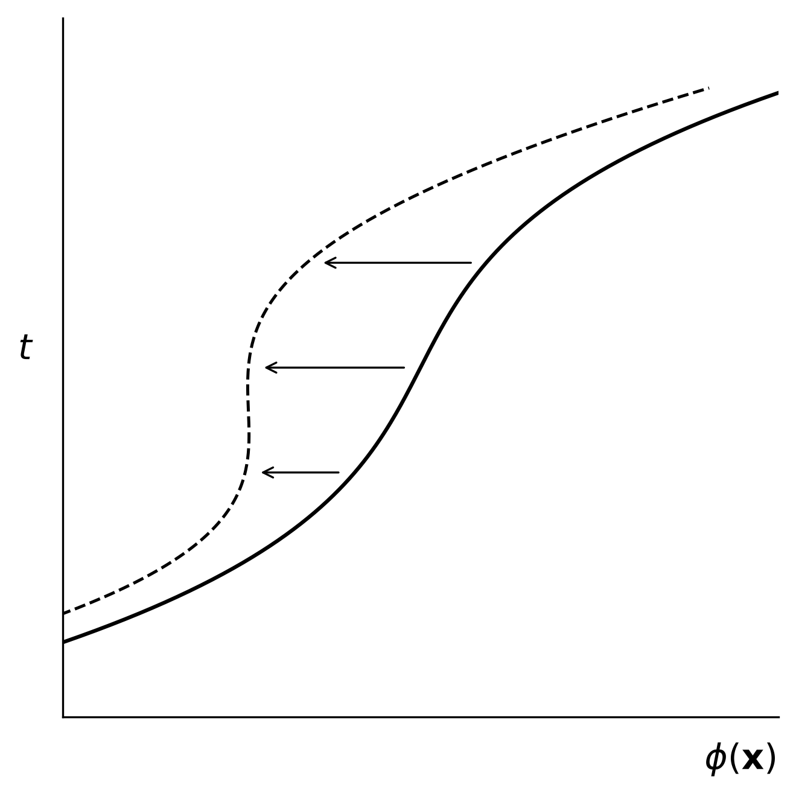
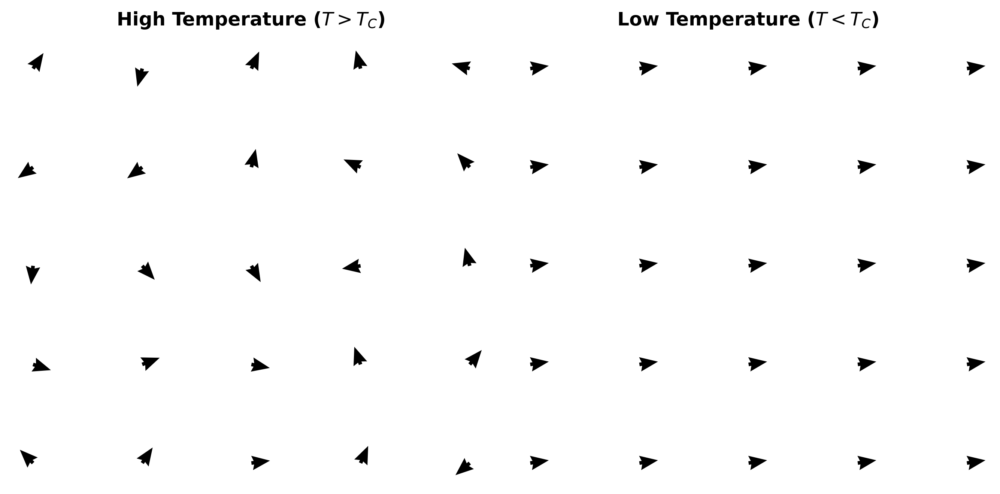
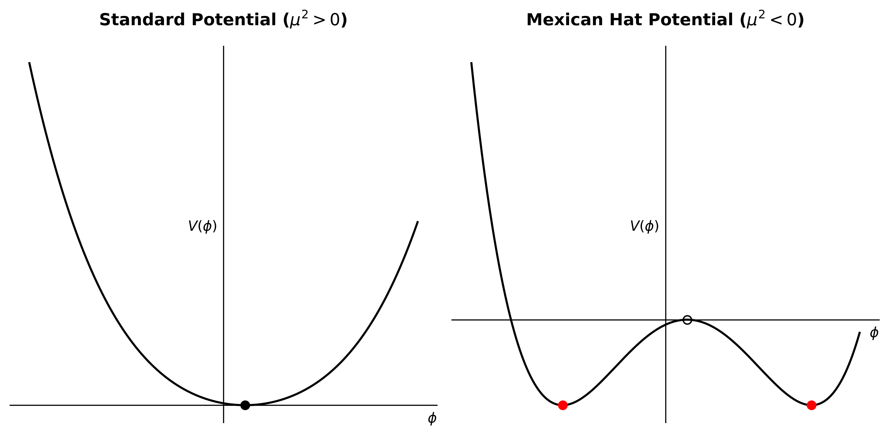

# Mathematical Modeling & Computational Analysis of the Higgs Mechanism

### Academic Background & Context
* **Author:** Genady Tabachnik
* **Affiliation:** Department of Physics and Mathematics, University of Haifa
* **Project Type:** B.Sc. Final Capstone Research Project
* **Curriculum:** Elementary Particles Course (June 2022)
* **Primary Portfolio:** Portfolio: https://github.com/GenaTab1993 | http://linkedin.com/in/genady-tabachnik-6899ba1b5

---

### 1. Global vs. Local Gauge Symmetry Configurations
The scripts map the physical behavior of continuous and broken field symmetry configuration layers under spatial translations and local gauge transformations.
* **Source Code:** `fig1a_global_symmetry.py` & `fig1b_local_symmetry.py`
* **Visual Output:**
  
  
  

### 2. Thermal Disordered States (Ferromagnetic Spin Analogy)
Simulates spontaneous symmetry breaking as a temperature-dependent phase transition, tracking the change from high-temperature isotropic disorder to a low-temperature perfectly aligned configuration.
* **Source Code:** `fig2_ferromagnet_spins.py`
* **Visual Output:**
  
  

### 3. The Goldstone Theorem & Mexican Hat Potential
Executes exact non-linear potential plotting to contrast a standard stable scalar field against a tachyonic mass parameter field, capturing the unstable local maximum and degenerate vacuum ground states.
* **Source Code:** `fig3_higgs_potentials.py`
* **Visual Output:**
  
  

---

## Theoretical Derivations & Full Research Paper
While this repository hosts the core computational engine and image assets, the complete academic report, mathematical proofs, and theoretical derivations are archived in a standardized technical whitepaper format.

👉 **[Read the Full Research Whitepaper https://docs.google.com/document/d/17ehTm3tJg413YPlPmgKX7uCgGYAO21YLB0cjl71qboE/edit?usp=drive_link]**

---

## Technical Stack & Dependencies
* **Language:** Python 3.x
* **Core Libraries:** `numpy` (Vectorized coordinate arrays), `matplotlib` (LaTeX integrated vector rendering)
* **Execution Standard:** Peer-reviewed data logging and flat vector graphic deployment (`dpi=300`).
